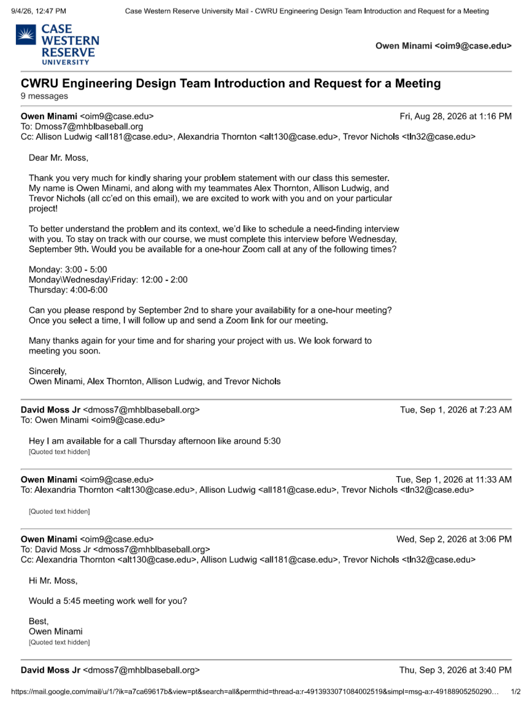
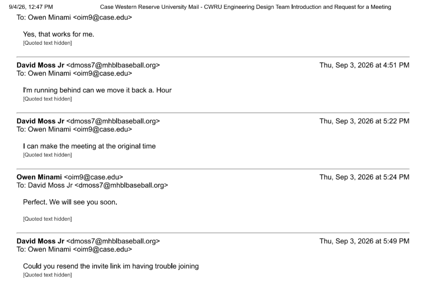

# Week 2

Week: 2
Document: Overview of Work

Note: (I) at the end of a statement represents that the task was completed individually.  (T) represents that the task was completed by the team.

**Date:** 8/26/26

Goal: Practice connecting documents between VS Code and GitHub 
+ Create document to practice connecting GitHub and VS Code (I)

**Date:** 8/28/26

+ Team revised email to David Moss (T)
+ Owen sent email (T)

**Date** 9/1/2026

+ David Moss replied with availability(T)

**Date:** 9/2/2026

+ Owen replied to David Moss confirming meeting time (T)

**Date:** 9/3/26

Goal: Conduct a Need-Finding Interview

+ 3:40pm: David Moss confirms meeting time (T)

+ 5:30pm: Our team (Owen, Trevor, Alex, and myself) met in Glennan student lounge to discuss our interview strategy (T)
+ 5:45pm: Our team met via Zoom with Mr. David Moss to discuss his problem statement (T)

**Meeting Minutes**

5:45pm: Meeting Starts
5:45pm: Introductions
+ Each student introduces themselves
+ Ask stakeholder to introduce himself
5:50pm-6:30pm: Ask for description of pitch, hit, and run competition.

GENERAL:
+ Players range from ages 7 to 16
+ All ages compete at the same time and place
+ Participants: 6 coaches; players: min of 40-50 up to 80-100
+ MLB hosts, so all info should be standard and online
+ Players hold on to their own card that keeps their score
+ Overall vibe is fun, competitive, laid-back
+ Outdoor facility; just open field, but they do not play in adverse weather conditions
+ Stafford Field, usually field 1
+ Try to run events separate from each other, but can occur simultaneously
+ Most difficult part of tear down is after hit, it takes a lot of time to collect the baseballs
+ Players have lots of down time in between events
+ Event occurs once a year, typically in June or July
+ Length of event is dependent on number of players

HIT:
+ 20 balls hit like the Home Run Derby
+ Get a certain number of pitches from another player/coach
+ Points based on distance
+ There is a maximum number of points that stays constant past a distance

PITCH:
+ 20 pitches thrown at a target
+ More points based on how close to the center of target
+ Strike zone is constant
+ Pitching from flat ground, not a mount
+ A few different distances from target depending on player's ability
+ Target is made of a banner on a gate
+ Human judge is used to see where ball hits target

RUN:
+ Distance is from one base to another
+ Time starts when player leaves first base, time ends when player touches second base
+ Generally one judge recording time at first base and one recording at second base to mitigate concerns on inaccurate timing
+ Stopwatch is used to track time

6:30pm-6:45pm: Closing remarks
+ Our group will email David Moss when we learn when our next meeting will be
+ David Moss will send our group videos of the hit, pitch, and run competition

6:30pm-7:00pm: Team meeting w/out David Moss to debrief meeting
+ Our group is in agreement that we built a friendly rapport with David Moss
+ Difficult to hear over Zoom because David was in a public place
+ Consider asking David to join the meeting on a different device or in a less noisy area for further meetings
+ Discuss availability for a meeting to construct affinity diagram
+ Currently unclear as to (a) how many aspects of the hit, pitch, and run competition we need to design our device to improve and (b) how many devices we need to prototype

+ I organized lab meeting notes after the meeting into categories of hit, pitch, run, and general (I).

**Date:** 9/4/2026

Goal: Complete Lab 2
+ Gather hardware (ESP32 and USB-C cable) (I)
+ Download PlatformIO IDE on VS Code (I)
+ Create new project in PlatformIO named Blink_Test, on Adafruit Feather ESP32 V2, on framework Arduino (I)
+ Use Skeleton Code.md as a framework for code (I)
+ Record video of ESP32 blinking and place video in Lab 2 Folder on GitHub (I)